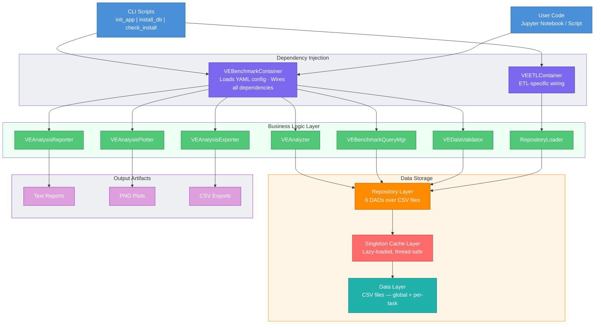

```mermaid
graph TB
    CLI["CLI Scripts\ninit_app | install_db | check_install"]
    NB["User Code\nJupyter Notebook / Script"]

    subgraph DI["Dependency Injection"]
        Container["VEBenchmarkContainer\nLoads YAML config · Wires all dependencies"]
        ETLContainer["VEETLContainer\nETL-specific wiring"]
    end

    subgraph BL["Business Logic Layer"]
        Analyzer["VEAnalyzer"]
        QueryMgr["VEBenchmarkQueryMgr"]
        Reporter["VEAnalysisReporter"]
        Plotter["VEAnalysisPlotter"]
        Exporter["VEAnalysisExporter"]
        DataVal["VEDataValidator"]
        RepoLoader["RepositoryLoader"]
    end

    subgraph DS["Data Storage"]
        Repos["Repository Layer\n6 DAOs over CSV files"]
        Caches["Singleton Cache Layer\nLazy-loaded, thread-safe"]
        DataFiles["Data Layer\nCSV files — global + per-task"]
    end

    subgraph OUT["Output Artifacts"]
        TextReport["Text Reports"]
        Plots["PNG Plots"]
        CSVExport["CSV Exports"]
    end

    CLI --> Container
    NB --> Container
    CLI --> ETLContainer

    Container --> Analyzer
    Container --> QueryMgr
    Container --> DataVal
    Container --> Reporter
    Container --> Plotter
    Container --> Exporter
    ETLContainer --> RepoLoader

    Analyzer --> Repos
    QueryMgr --> Repos
    DataVal --> Repos
    RepoLoader --> Repos

    Repos --> Caches
    Caches --> DataFiles

    Reporter --> TextReport
    Plotter --> Plots
    Exporter --> CSVExport

    classDef entry fill:#4A90D9,stroke:#2C5F8A,color:#fff
    classDef di fill:#7B68EE,stroke:#4B3AB5,color:#fff
    classDef biz fill:#50C878,stroke:#2E8449,color:#fff
    classDef repo fill:#FF8C00,stroke:#B35C00,color:#fff
    classDef cache fill:#FF6B6B,stroke:#C0392B,color:#fff
    classDef data fill:#20B2AA,stroke:#0D7A74,color:#fff
    classDef output fill:#DDA0DD,stroke:#9932CC,color:#fff

    class CLI,NB entry
    class Container,ETLContainer di
    class Analyzer,QueryMgr,Reporter,Plotter,Exporter,DataVal,RepoLoader biz
    class Repos repo
    class Caches cache
    class DataFiles data
    class TextReport,Plots,CSVExport output

    %% Subgraph backgrounds
    style DI fill:#EEEFF3,stroke:#7B6EEE,color:#333
    style BL fill:#EEFFF3,stroke:#7B6EEE,color:#333
    style DS fill:#FFF5E6,stroke:#FF8C00,color:#333
    style OUT fill:#EEEFF3,stroke:#9932CC,color:#333
```
